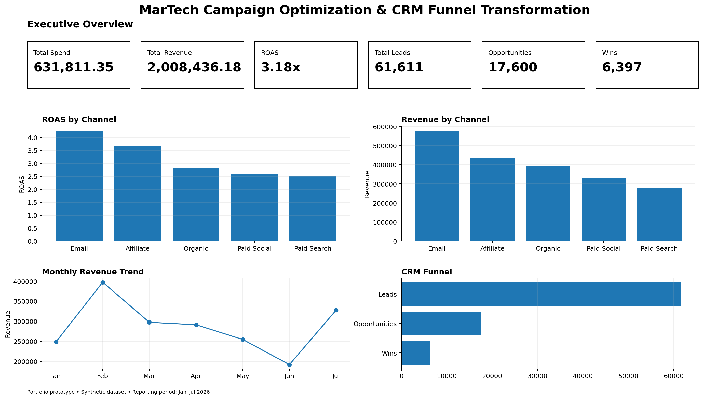
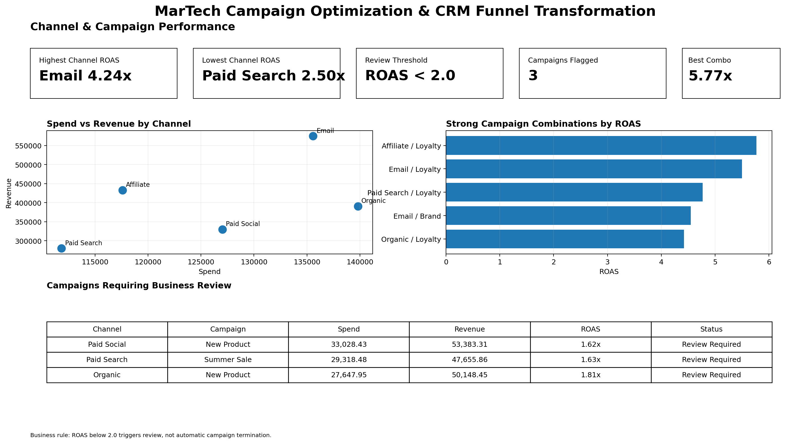
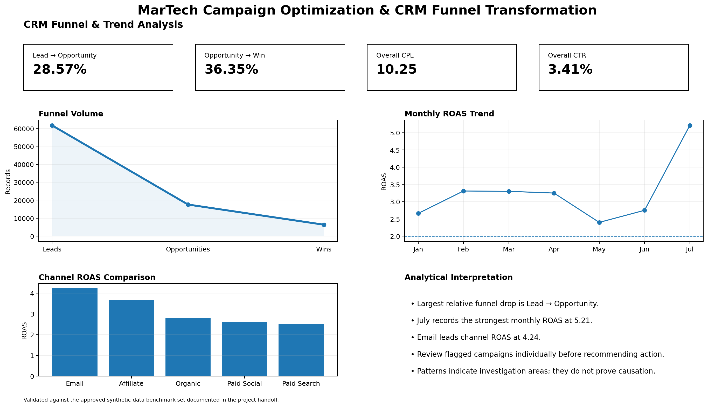

# MarTech Campaign Optimization & CRM Funnel Transformation

Business Analyst / Business Systems Analyst portfolio case study using synthetic data.

This project demonstrates an end-to-end BA/BSA approach to improving fragmented Marketing and CRM reporting across the funnel:

**Lead → Opportunity → Win → Revenue**

## Business Problem

The fictional organization had:

- Separate Marketing and CRM reporting
- Manual consolidation and reconciliation
- Inconsistent KPI definitions
- Limited campaign-to-CRM visibility
- Data-quality and mapping issues
- Delayed business insights

## What I Created

- Project Charter
- Stakeholder Analysis & RACI
- AS-IS / TO-BE Process
- Gap Analysis
- BRD & FRD
- Business Rules & KPI Definitions
- Agile User Stories & Acceptance Criteria
- Requirements Traceability Matrix
- Data Requirements & Mapping
- SQL Data Validation & Analysis
- Business Insights
- Dashboard Requirements & Reporting Views
- Integration Requirements
- UAT Test Design
- Defect Management Framework
- Change Impact & Release Readiness

## Key Results

| KPI | Result |
|---|---:|
| Marketing Spend | 631,811.35 |
| Revenue | 2,008,436.18 |
| ROAS | 3.18 |
| Leads | 61,611 |
| Opportunities | 17,600 |
| Wins | 6,397 |
| Lead-to-Opportunity Conversion | 28.57% |
| Opportunity Win Rate | 36.35% |

## Dashboard

### Executive Overview

### Channel & Campaign Performance

### CRM Funnel & Trend Analysis

## Key Project Files

- [Project Charter](PROJECT_CHARTER.md)
- [BRD](documentation/BRD.md)
- [FRD](documentation/FRD.md)
- [Agile Backlog](documentation/AGILE_BACKLOG.md)
- [Process Analysis](process/PROCESS.md)
- [SQL Analysis](sql/analysis.sql)
- [Business Insights](documentation/BUSINESS_INSIGHTS.md)
- [Dashboard Documentation](dashboard/README.md)
- [Integration Requirements](api/INTEGRATION_REQUIREMENTS.md)
- [UAT Test Cases](testing/UAT_TEST_CASES.md)
- [Requirements Traceability Matrix](documentation/REQUIREMENTS_TRACEABILITY_MATRIX.md)

## Skills Demonstrated

Requirements Gathering • BRD/FRD • Stakeholder Management • AS-IS/TO-BE • Gap Analysis • Agile User Stories • CRM Funnel Analysis • SQL • Data Mapping • Reporting Requirements • REST API Requirements • UAT • Traceability • Release Readiness

## Disclaimer

This is a fictional portfolio case study using synthetic data. It does not represent a real client implementation or contain confidential information.
