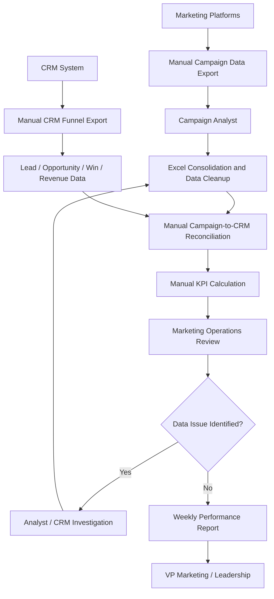
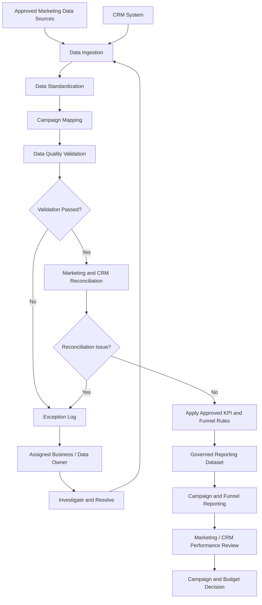

# Business Process Analysis

## 1. Purpose

This document captures the current-state (AS-IS) campaign performance
reporting process identified during stakeholder discovery and defines the
future-state (TO-BE) process designed to address the identified business gaps.

The objective of the process analysis is to understand how campaign and CRM
funnel information is currently collected, reconciled, reported and consumed,
and how the process should operate in the future.

---

# 2. AS-IS Business Process

The organization runs marketing campaigns across multiple digital channels.

Campaign performance information is generated by separate marketing
platforms, while Lead, Opportunity, Win and Revenue information is
maintained within the CRM environment.

A Campaign Performance Analyst manually consolidates these datasets
to prepare weekly performance reporting for Marketing leadership.

### Current Process

1. Campaign performance data is exported manually from individual
   marketing platforms.

2. The Campaign Performance Analyst downloads the files and combines
   them into a working spreadsheet.

3. Campaign names, dates and channel values are manually standardized
   where required.

4. CRM funnel data containing Leads, Opportunities, Wins and Revenue
   is exported separately.

5. Marketing campaign data is manually reconciled with CRM funnel data.

6. Campaign KPIs such as CTR, CPL, conversion rates and ROAS are
   calculated within spreadsheets.

7. The consolidated report is reviewed by the Marketing Operations Manager.

8. Data discrepancies are sent back to the Campaign Analyst or CRM team
   for investigation.

9. Corrections are manually incorporated into the reporting file.

10. Final campaign performance results are shared with Marketing leadership
    through weekly reporting.

---

# 3. AS-IS Process Flow

---

# 4. Current-State Pain Points

| ID | Pain Point | Business Impact |
|---|---|---|
| P-01 | Campaign data is manually exported from multiple platforms | Reporting preparation requires significant analyst effort |
| P-02 | Campaign naming and formatting are not fully standardized across sources | Additional data cleansing and mapping are required |
| P-03 | Marketing and CRM data are maintained separately | Funnel performance cannot be viewed easily from campaign through revenue |
| P-04 | KPI calculations are performed manually in spreadsheets | Greater risk of inconsistent formulas and reporting errors |
| P-05 | Lead and conversion figures require reconciliation between Marketing and CRM | Stakeholders may receive conflicting performance numbers |
| P-06 | Data issues are resolved through manual communication and rework | Reporting cycles are delayed |
| P-07 | Leadership primarily receives periodic static reporting | Underperforming campaigns may not be identified quickly |

---

# 5. Business Impact

The current process results in:

- High manual reporting effort
- Repeated data reconciliation
- Delayed campaign insights
- Risk of inconsistent KPI calculations
- Limited end-to-end funnel visibility
- Reduced confidence in reported performance
- Slower marketing budget optimization decisions

---

# 6. BA Observation

The primary issue is not the absence of campaign data.

The organization already captures significant marketing and CRM data.

The key problem is that the information is fragmented across systems,
requires manual reconciliation and does not provide stakeholders with a
consistent end-to-end view from marketing spend through revenue.

These findings were used as inputs to the detailed business requirements,
gap analysis and future-state process design.

---

# 7. TO-BE Business Process

## 7.1 Future-State Objective

The future-state process is designed to reduce manual campaign reporting
effort while establishing consistent Marketing and CRM reporting rules.

The TO-BE process addresses the current-state gaps through:

- Standardized campaign data consolidation
- Agreed campaign-to-CRM mapping rules
- Governed KPI definitions
- Automated or repeatable data-quality validation
- Defined exception handling
- Consistent CRM funnel reporting
- Clear business ownership
- More timely performance visibility

The objective is not only to improve the reporting interface, but also
to improve the process used to create trusted campaign performance
information.

---

## 7.2 TO-BE Process Flow

---

# 8. TO-BE Process Steps

### Step 1 — Data Acquisition

Campaign and CRM data are obtained from approved source systems through
a repeatable ingestion process.

The target process should reduce dependency on analysts manually
downloading and combining separate reporting files.

---

### Step 2 — Data Standardization

Required attributes such as:

- Campaign identifier
- Campaign name
- Marketing channel
- Reporting date

are standardized before records are used for official reporting.

---

### Step 3 — Campaign Mapping

Approved campaign mapping rules are applied to associate Marketing
campaign activity with the relevant CRM funnel and Revenue information.

Records that cannot be mapped are not automatically attributed.

They are routed to exception handling for investigation.

---

### Step 4 — Data Quality Validation

Incoming records are checked against agreed validation rules.

Examples may include:

- Missing required identifiers
- Invalid or unmapped campaign values
- Invalid numeric values
- Missing required reporting attributes
- Records that cannot be reconciled

Records that fail required validation remain distinguishable from
validated reporting data.

---

### Step 5 — Marketing / CRM Reconciliation

Campaign-level Marketing information is compared with corresponding
CRM funnel data where reconciliation is required.

Material discrepancies are flagged for investigation instead of being
manually forced to match.

---

### Step 6 — KPI & Funnel Processing

Validated records are processed using the approved business definitions
for:

- CTR
- CPL
- Lead-to-Opportunity Conversion Rate
- Opportunity Win Rate
- ROAS
- Lead
- Opportunity
- Win
- Revenue

The same governed definitions are used throughout official reporting.

---

### Step 7 — Governed Reporting Dataset

Validated and reconciled information is made available through a common
reporting dataset.

Data-quality exceptions remain separately identifiable so that unresolved
issues do not silently affect business reporting.

---

### Step 8 — Business Reporting

Authorized stakeholders can review campaign and CRM funnel performance
by supported dimensions such as:

- Reporting period
- Marketing channel
- Campaign

Reporting provides visibility into campaign Spend, funnel progression,
Revenue and approved campaign KPIs.

---

### Step 9 — Exception Investigation

Where mapping, data-quality or reconciliation issues occur, the exception
is assigned to the appropriate business or data owner.

The issue is investigated and corrected where appropriate before affected
information is treated as validated reporting data.

---

### Step 10 — Performance Review & Business Decision

Marketing and CRM stakeholders review campaign and funnel performance.

Campaigns meeting the agreed review criteria may be investigated for
possible optimization.

The reporting solution supports decision-making but does not automatically
change campaign budgets or stop campaigns.

Final business decisions remain with the responsible stakeholders.

---

# 9. AS-IS vs TO-BE Comparison

| Area | AS-IS | TO-BE |
|---|---|---|
| Data Collection | Manual exports from multiple sources | Repeatable ingestion from approved sources |
| Consolidation | Analyst manually combines files | Standardized consolidation process |
| Campaign Mapping | Manual reconciliation | Approved mapping rules with exception handling |
| KPI Calculation | Spreadsheet formulas | Governed KPI definitions applied consistently |
| CRM Funnel | Reviewed separately / reconciled manually | Integrated Lead → Opportunity → Win visibility |
| Data Quality | Issues often identified during reporting review | Validation occurs before official reporting |
| Exceptions | Email / manual investigation | Defined exception workflow and ownership |
| Reporting | Periodic manually prepared output | Governed and more timely performance reporting |
| Governance | Distributed / inconsistent definitions | Defined KPI, funnel and issue ownership |
| Decision Making | Delayed by preparation and reconciliation | Faster access to trusted performance information |

---

# 10. Gap Closure Mapping

| Gap | TO-BE Improvement |
|---|---|
| G-01 — Manual consolidation | Repeatable Marketing and CRM data ingestion and consolidation |
| G-02 — Inconsistent KPI definitions | Approved KPI definitions applied to official reporting |
| G-03 — Limited campaign-to-CRM visibility | Integrated campaign and CRM funnel reporting |
| G-04 — Manual funnel reconciliation | Defined reconciliation rules and exception handling |
| G-05 — Inconsistent campaign identifiers | Standardized campaign attributes and mapping rules |
| G-06 — Manual data-quality investigation | Validation and structured exception management |
| G-07 — Delayed performance visibility | Governed and more timely reporting process |
| G-08 — Unclear ownership | Defined business, KPI and exception ownership |

---

# 11. BA Role in Future-State Design

The Business Analyst facilitated future-state process definition by:

- Reviewing AS-IS pain points with stakeholders
- Linking proposed process changes to identified business gaps
- Facilitating agreement between Marketing, CRM and technical stakeholders
- Clarifying KPI, funnel and campaign-mapping business rules
- Documenting exception and reconciliation requirements
- Ensuring the proposed process addressed approved business requirements
- Identifying stakeholder ownership and decision points
- Maintaining traceability between process changes and requirements

The detailed technical architecture and implementation approach will be
defined collaboratively with the appropriate technical stakeholders.
