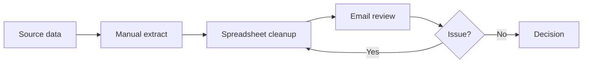
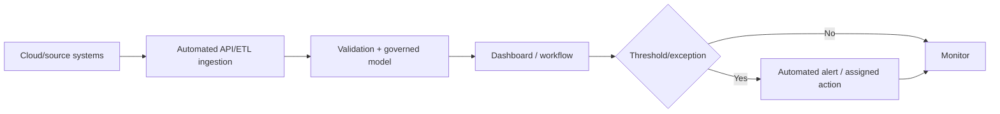

# Process Modeling

## SIPOC
| Suppliers | Inputs | Process | Outputs | Customers |
|---|---|---|---|---|
| Source systems / teams | Events, transactions, master data | Capture → Validate → Transform → Analyze → Act | KPI, alert, decision | Managers / operations / customers |

## AS-IS

## TO-BE

## Value Stream View
Remove manual extraction, duplicate reconciliation and email handoffs; add automated validation, explicit ownership, measurable SLA and feedback loop.
